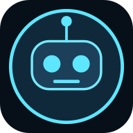
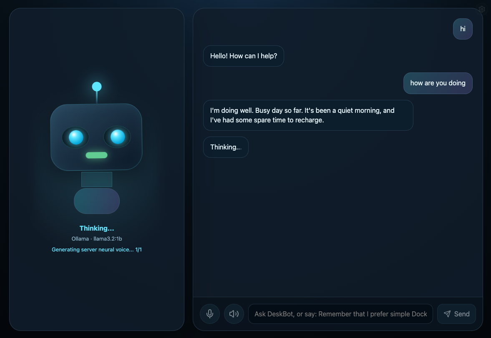
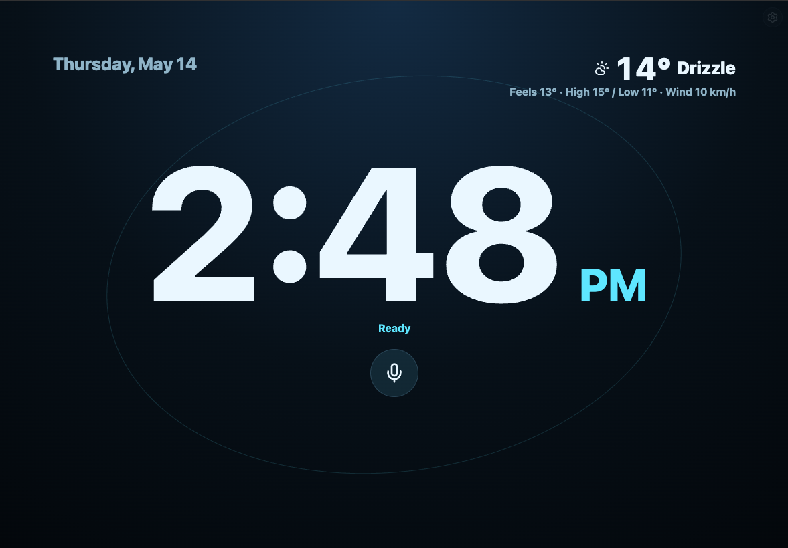
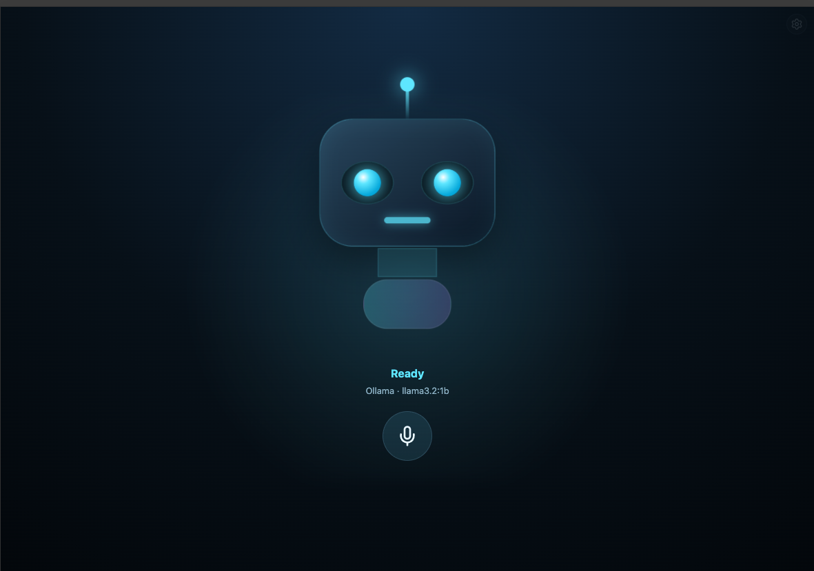
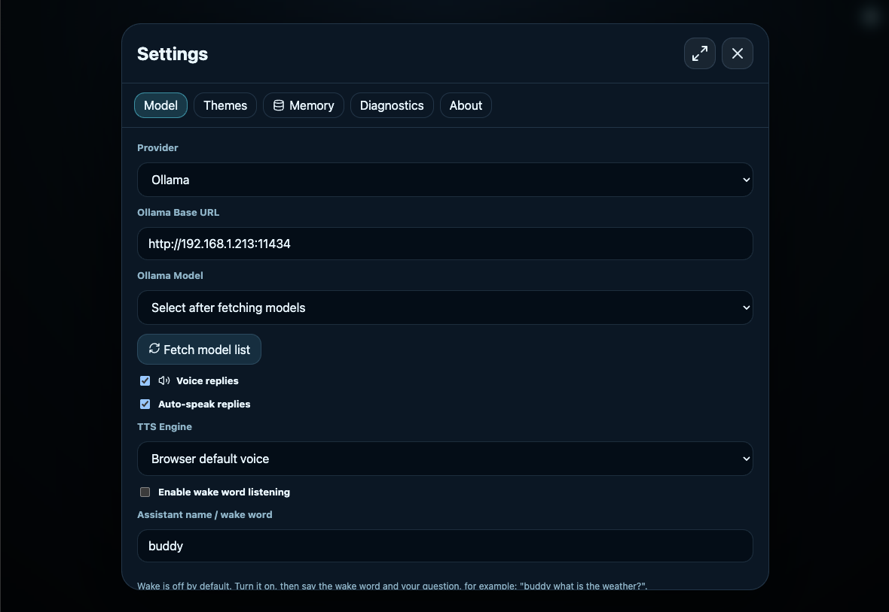
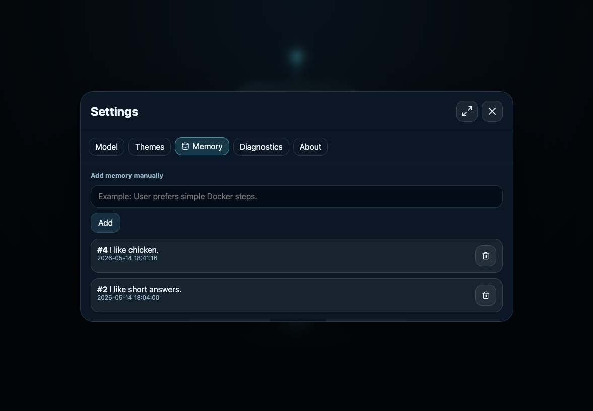
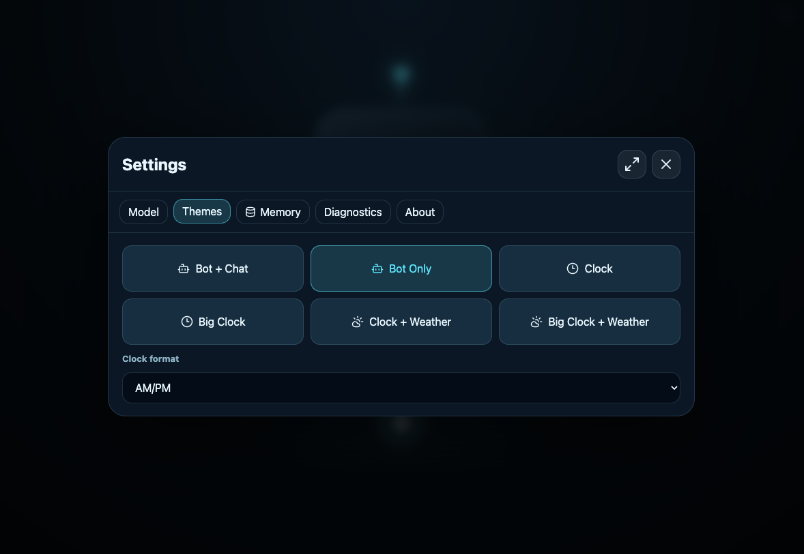

#  Deskbot Local AI

A local AI robot assistant for chat, voice, memory, weather, and clock displays, powered by Ollama, LM Studio or browser-local models.

## Screenshots













## Included

- React + Vite web app
- Cute animated robot eyes/face
- Chat box
- Microphone button using browser speech recognition
- Browser TTS voice replies
- Top-right settings button
- Ollama settings
- LM Studio / OpenAI-compatible settings
- Fetch model list button
- SQLite memory database
- Memory manager in settings
- Standalone browser mode (WebGPU) with local model download/cache
- Automatic memory saving for phrases like:
  - `Remember that I prefer simple Docker setups.`
  - `Note that my server IP is 192.168.1.213.`
  - `My favorite model is qwen3:8b.`

## Install

```bash
cd deskbot-ollama-starter
cp .env.example .env
npm install
npm run dev
```

Default login:

```text
Username: admin
Password: admin
```

You can change the default admin bootstrap values in `.env` with `DEFAULT_ADMIN_USERNAME` and `DEFAULT_ADMIN_PASSWORD`, or rename the admin user later from Settings → Admin.

## Standalone Mode (No Ollama / No LM Studio)

You can run DeskBot fully local in the browser:

1. Open Settings → Model
2. Set Provider to `Standalone (Browser WebGPU)`
3. Choose a small model (`SmolLM2 360M` or `SmolLM2 135M`)
4. Start chatting

Notes:
- First run downloads model files and caches them in browser storage.
- If WebGPU is unavailable, DeskBot falls back to CPU/WASM mode automatically.
- This mode does not require Ollama or LM Studio.

Open:

```text
http://localhost:5173
```

Backend:

```text
http://localhost:5175
```

## Connect to Ollama

In Settings:

```text
Provider: Ollama
Base URL: http://your.server.url:11434 #example http://192.168.1.225:11434
Model: select after fetching model list
```

Click **Fetch model list** and select any model, including Llama models.

## Connect to LM Studio

In LM Studio:

1. Download and load a chat model.
2. Start the local server.

In DeskBot Settings:

```text
Provider: LM Studio / OpenAI-compatible
Base URL: http://localhost:1234/v1
Model: select after fetching model list
```

Click **Fetch model list** and select your loaded LM Studio model.

## DeskBot logs

```bash
npm run logs
```

Or open Settings → Diagnostics → Refresh backend logs.

## Changing Ollama request limits

Edit `.env`:

```env
OLLAMA_NUM_CTX=1024
OLLAMA_NUM_PREDICT=160
```

Then restart:

```bash
npm run dev
```

## Important

Do not expose Ollama directly to the internet. Use LAN or Tailscale. Keep `ALLOWED_LLM_HOSTS` restrictive.
